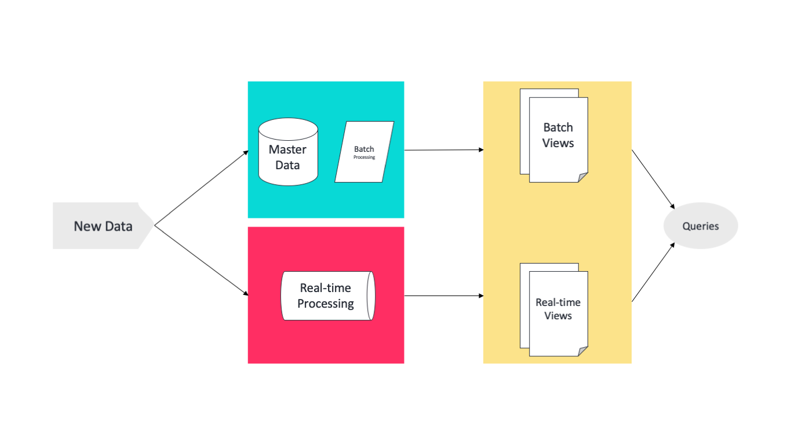
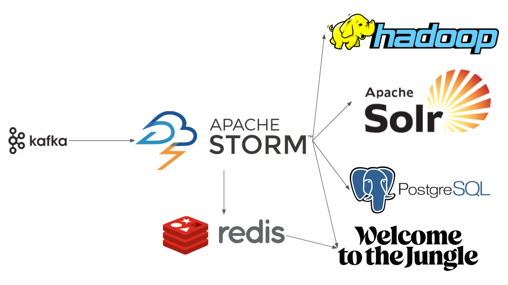

# Scalability

After some research, I came up with 2 solutions. Both of them are valid and in a professional context, I would discuss the 2 options with my teammates to pick the best one.

### Homemade oriented - Lambda architecture
Reference: https://databricks.com/glossary/lambda-architecture

Lambda architure is a simple concept that helps processing massive quantities of data while providing a real time access to the incoming. The idea is simply to have 2 different pipeline handling simulteanously the incoming data. However one handle the data by batch (takes longer but write the data) and the other process the data as a stream.

Finally the output of the 2 layer are processed by a 3rd layer that merges the results and returns a single result as output.

#### Pros

 - homemade: since we develop each layers, we are the true owner of the system
 - no software management: we don't have to deal with 3rd party software
 - cheap: 3rd party can be expensive

#### Cons

 - complexity: this is neither easy to develop nor to maintain

### Service oriented - Big data pipeline

There is a much better solution relying on 3rd party software. This is basically a Big Data Pipeline. There are many existing system therefore many possibilities however I have something like this in mind:

This system relies mostly on open source software from Apache. The major component is `APACHE STORM`. STORM is made to process large streams of data.
The idea would be to use Storm to process the incoming offers (for example finding the continent of the offer) and then dispatch the result into different systems.

We can store the final result either in a Data Warehouse or Hadoop. We could also push some data into a search system (here Solr but it could also be elasticsearch).
Optionally, we can keep a REDIS with some computed data to have a real time dashboard.

Finally, we can plug our own softwares to either REDIS or STORM to trigger events or display reports.

#### Pros

 - reliable: those software are flawless
 - optimized: this offer the most optimized components
 - open-source: can be cheap if we stick to open source

#### Cons

 - Hard to maintain and setup